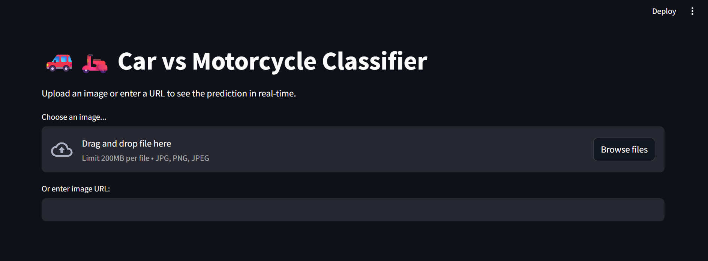

# Car vs Motorcycle Classification

## Project Overview
This project aims to classify images of cars and motorcycles with high accuracy using a Convolutional Neural Network (CNN) based on MobileNetV2. The model is trained on a dataset of 4000 images (2000 per class) and tested on unseen images, including real-world images from the internet.

## Dataset
- Total images: 4000 (2000 cars, 2000 motorcycles)
- Split: Train 70%, Validation 15%, Test 15%
- Preprocessing:
  - Resized to 224x224
  - Normalization with ImageNet mean and std
  - Data augmentation: RandomRotation, HorizontalFlip, ColorJitter (optional)

- Download: https://www.kaggle.com/datasets/utkarshsaxenadn/car-vs-bike-classification-dataset

## Model Architecture
- MobileNetV2 (pretrained on ImageNet)
- Fully connected classifier head:
  - Linear layer (in_features → 256)
  - ReLU + Dropout(0.2)
  - Linear layer (256 → 2)
- Loss function: CrossEntropyLoss
- Optimizer: Adam
- Learning rate scheduler: ReduceLROnPlateau
- Early stopping: implemented

## Training Results
| Metric       | Train | Validation | Test (real-world images) |
|-------------|-------|------------|-------------------------|
| Accuracy    | 99.6% | 99.5%      | 99.4%                   |
| Loss        | 0.013 | 0.0127     | 0.0108                  |

**Confusion Matrix** and sample predictions can be added here.

## Challenges
- Overfitting prevention with dropout and augmentation
- Ensuring real-world generalization (tested on diverse images from the internet)
- Dataset splitting and preprocessing to avoid data leakage

## How to Run the Model

1. Install dependencies:
```bash
pip install torch torchvision streamlit pillow
```

2. Place your trained model in models/best_model.pth

3. Run the Streamlit demo:
```bash
streamlit run demo.py
```

## Demo
